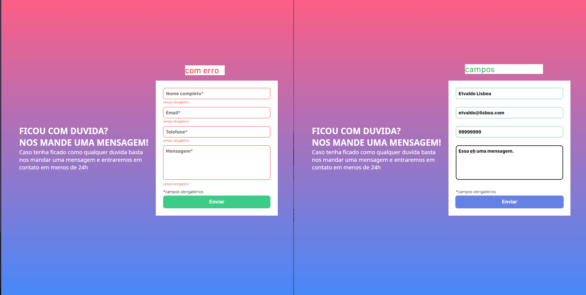

# Formulario dev quest

## Ojetivo
Criar um formulario com validacao mostrando uma mensagem de erro caso um dos campos nao seja preenchido ou mudar a borda do campo para verde limão caso esteja preenchido.

## Pagina do projeto

- [Pagina para acessar o projeto](https://etvaldolisboa.github.io/formulario-com-validacao/)