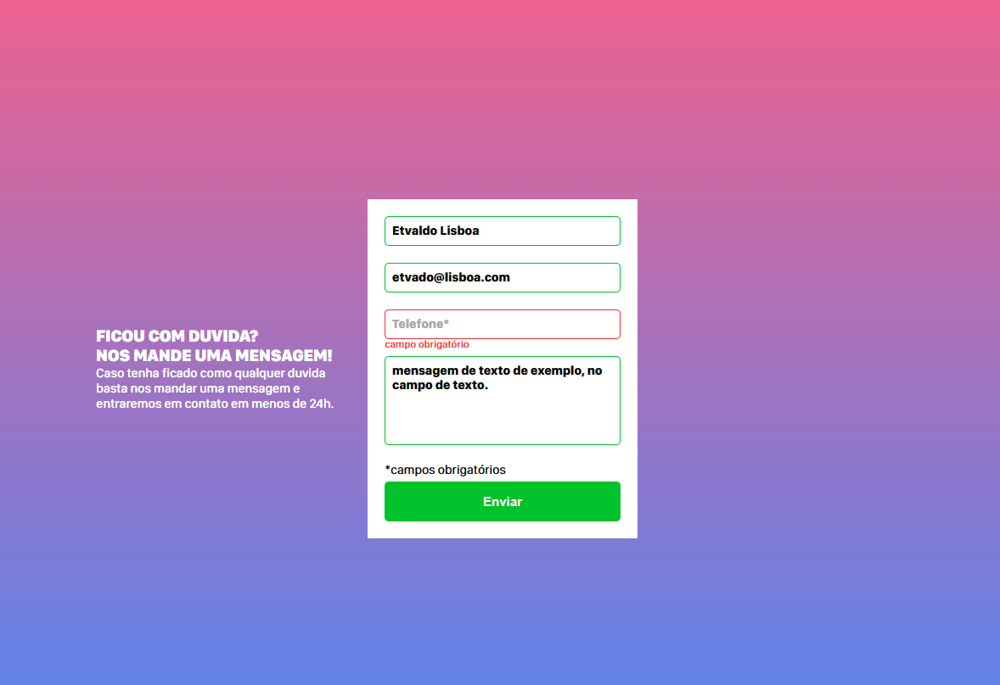

# DevQuest - Desafio: Formulário com Validação

## Sobre o Desafio 🚀

Neste desafio do curso DevQuest, foi proposto criar um formulário com validação utilizando HTML, CSS e JavaScript. O objetivo era seguir o design fornecido no Figma e garantir que o formulário fosse responsivo em dispositivos móveis. 📱💻

## Layout do formulario 📄

## Link do Layout no Figma 🎨

[Clique aqui para visualizar o layout no Figma](https://www.figma.com/file/zBKnYG9UNdUiIr8ClQTWSG/DESAFIO---HTML%2FCSS%2FJS-INTERMEDI%C3%81RIO?node-id=34%3A529&mode=dev) 👀

## Layout Responsivo 📱

Para tornar o formulário responsivo em dispositivos móveis, foi criado um layout alternativo usando CSS para ajustar os elementos conforme o tamanho da tela. Foram utilizadas media queries para aplicar estilos específicos para diferentes tamanhos de tela, garantindo uma experiência de usuário otimizada tanto em desktops quanto em smartphones. 📏

## Tecnologias Utilizadas 💻

- HTML
- CSS
- JavaScript

## Funcionalidades do Formulário ✨

O formulário desenvolvido possui as seguintes funcionalidades:

1. Validação dos campos obrigatórios: todos os campos obrigatórios são verificados antes do envio do formulário para garantir que estejam preenchidos corretamente.
2. Exibição de mensagens de erro: caso algum campo obrigatório não tenha sido preenchido, uma mensagem de erro é exibida em baxo do campo.
3. Validação do campo de e-mail: o campo de e-mail é verificado para garantir que o formato inserido seja válido.
4. Máscara no campo de telefone: o campo de telefone possui uma máscara para garantir que o usuário insira os dígitos no formato correto. 📞💼

## Instruções para Execução 🛠️

1. Clone o repositório do projeto em sua máquina local.
2. Abra o arquivo "index.html" em seu navegador de preferência.
3. Preencha o formulário e teste as funcionalidades de validação.

## Considerações Finais 🎉

O desafio de criar um formulário com validação foi uma oportunidade para aprimorar os conhecimentos em HTML, CSS e JavaScript. Além disso, a criação do layout responsivo permitiu desenvolver habilidades em design responsivo e adaptação para dispositivos móveis.

Foi uma experiência enriquecedora e divertida, e estou animado para continuar aprendendo e desenvolvendo novos projetos no curso DevQuest. 🚀✨

## Pagina do projeto

- [Acessar página do projeto](https://etvaldolisboa.github.io/formulario-com-validacao/)